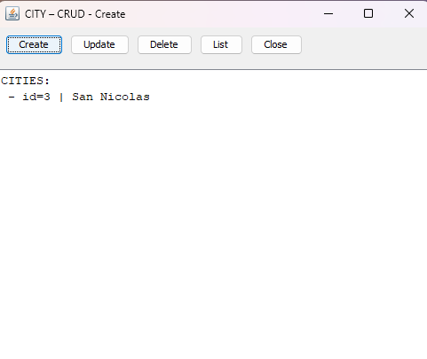
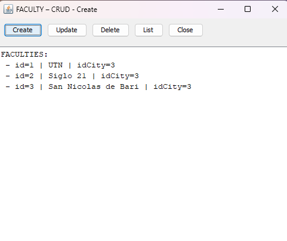
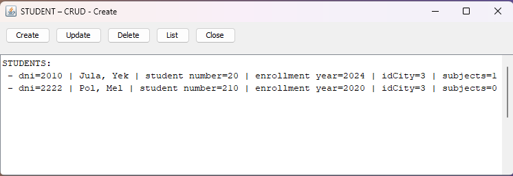

# Hibernate Project - Faculty Management System

[](https://opensource.org/licenses/MIT)
[](https://www.oracle.com/java/)
[](https://hibernate.org/)
[](https://www.mysql.com/)
[](https://netbeans.apache.org/)

Academic management system developed with **Java Swing** and **Hibernate**, implementing **Clean Architecture** principles. Provides complete administration of academic domain entities (Cities, Faculties, Careers, Professors, Subjects, and Students).

> **📚 Academic Project**: This project is part of my learning process and demonstrates Clean Architecture and ORM concepts. It has been published to showcase my understanding of enterprise-level software design patterns and database management practices.

## Academic Context

This project was developed as part of the **Programming and Software Architecture** course at UTN.

**Important Note on Technology Versions**: The project uses specific versions of technologies (Hibernate 4.3.x, Java 8, NetBeans 8.2) as required by the academic curriculum. These versions were chosen by the faculty to align with the course's learning objectives and ensure compatibility with the teaching materials.

## 📋 Table of Contents

- [Academic Context](#academic-context)
- [Features](#features)
- [Screenshots](#screenshots)
- [Architecture](#architecture)
- [Project Structure](#project-structure)
- [Requirements](#requirements)
- [Installation](#installation)
- [Configuration](#configuration)
- [Usage](#usage)
- [Entity Diagrams](#entity-diagrams)
- [Data Flow](#data-flow)
- [Design Principles Applied](#design-principles-applied)
- [Project Metrics](#project-metrics)
- [Concepts Applied](#concepts-applied)
- [Important Notes](#important-notes)
- [License](#license)
- [References](#references)

## Features

### Functionality

- **Complete CRUD** for all entities:
  - ✅ City
  - ✅ Faculty
  - ✅ Career
  - ✅ Professor
  - ✅ Subject
  - ✅ Student

- **CRUD Operations**:
  - Create entities
  - Update entities
  - Delete entities
  - List entities

- **Special Features**:
  - Search by ID or name
  - List by level (Subjects)
  - Many-to-many relationship management (Student-Subject)
  - Intuitive Swing GUI

### Validations

- City unique by name (case-insensitive)
- Faculty unique by (name + city)
- Career unique by (name + faculty)
- Subject unique by (name + career)
- Professor: PK = DNI
- Student: PK = DNI

## Screenshots

> **Note**: Screenshots will be added to showcase the application's user interface and key features.


### Main Menu


### Entity Management





## Architecture

This project implements **Clean Architecture** with clear separation of responsibilities.

> **See detailed diagrams:** [Architecture Diagram](docs/diagrams/architecture.md) | [Entity Relationship](docs/diagrams/entity-relationship.md) | [Data Flow](docs/diagrams/data-flow.md)

### Architecture Layers

#### 📱 Presentation Layer (`src/presentation/`)
User interface with Swing. ABMs don't know Hibernate implementation details.

**Main classes:**
- `FacultyMenu` - Main menu of the application
- `*ABM.java` - Administration windows for each entity

#### 🎯 Application Layer (`src/app/service/`)
Interfaces that define business contracts.

**Interfaces:**
- `CityService`, `FacultyService`, `CareerService`, `ProfessorService`, `SubjectService`, `StudentService`

#### 🔧 Infrastructure Layer (`src/infra/service/`)
Concrete service implementations using Hibernate.

**Classes:**
- `BaseHibernateService` - Base class with common session/transaction patterns
- `Hibernate*Service` - Specific implementations

#### 📦 Domain Layer (`src/model/`)
Domain entities and utilities.

**Entities:**
- `City`, `Faculty`, `Career`, `Professor`, `Subject`, `Student`, `Person`

## Project Structure

```
Hibernate_Project/
├── docs/                          # Documentation
│   └── diagrams/                  # Architecture diagrams
│       ├── architecture.md
│       ├── entity-relationship.md
│       └── data-flow.md
│
├── lib/                           # Hibernate and MySQL libraries
│   ├── hibernate-core-4.3.1.Final.jar
│   ├── mysql-connector-j-9.5.0.jar
│   └── ...
│
├── src/
│   ├── presentation/             # 🎨 Presentation Layer
│   │   ├── FacultyMenu.java      # Main entry point
│   │   ├── CityABM.java
│   │   ├── FacultyABM.java
│   │   ├── CareerABM.java
│   │   ├── ProfessorABM.java
│   │   ├── SubjectABM.java
│   │   ├── StudentABM.java
│   │   └── FacultyManager.java   # Data initialization script
│   │
│   ├── app/                      # 🎯 Application Layer
│   │   └── service/              # Service interfaces
│   │       ├── CityService.java
│   │       ├── FacultyService.java
│   │       ├── CareerService.java
│   │       ├── ProfessorService.java
│   │       ├── SubjectService.java
│   │       └── StudentService.java
│   │
│   ├── infra/                    # 🔧 Infrastructure Layer
│   │   └── service/              # Hibernate implementations
│   │       ├── BaseHibernateService.java
│   │       ├── HibernateCityService.java
│   │       ├── HibernateFacultyService.java
│   │       ├── HibernateCareerService.java
│   │       ├── HibernateProfessorService.java
│   │       ├── HibernateSubjectService.java
│   │       └── HibernateStudentService.java
│   │
│   ├── model/                    # 📦 Domain Layer
│   │   ├── City.java
│   │   ├── Faculty.java
│   │   ├── Career.java
│   │   ├── Person.java
│   │   ├── Professor.java
│   │   ├── Subject.java
│   │   ├── Student.java
│   │   ├── MappingClasses.hbm.xml  # Hibernate mappings
│   │   └── util/
│   │       └── HibernateUtil.java
│   │
│   └── hibernate.cfg.xml         # Hibernate configuration
│
├── scripts/                      # Utility scripts
│   └── create_database.sql      # Database creation script
│
├── build.xml                     # Build script (Ant)
├── nbproject/                    # NetBeans configuration
└── README.md                     # This file
```

## Requirements

### Software

- **JDK 8 or higher** (Java 8+)
- **NetBeans 8.2+** (or any compatible IDE)
- **MySQL Server 8.0+**
- **Maven/Ant** (optional, for build)

### Dependencies

The following libraries are included in `/lib`:

- `hibernate-core-4.3.1.Final.jar`
- `mysql-connector-j-9.5.0.jar`
- `hibernate-commons-annotations-4.0.4.Final.jar`
- `hibernate-entitymanager-4.3.1.Final.jar`
- And other Hibernate dependencies

## Installation

### 1. Clone the Repository

```bash
git clone <repository-url>
cd Hibernate_Project
```

### 2. Create the Database

**⚠️ IMPORTANT:** You must create the database before running the application. Hibernate will create the tables automatically, but the database must exist first.

#### Option A: Using the SQL Script (Recommended)

1. Open MySQL command line or MySQL Workbench
2. Execute the provided script:
   ```bash
   mysql -u root -p < scripts/create_database.sql
   ```
   Or open `scripts/create_database.sql` in MySQL Workbench and run it.

#### Option B: Manual Creation

Run this SQL in MySQL:

```sql
CREATE DATABASE IF NOT EXISTS hibernate_test 
DEFAULT CHARACTER SET utf8mb4 
COLLATE utf8mb4_unicode_ci;
```

**Note:** The database name must match the one configured in `hibernate.cfg.xml` (currently: `hibernate_test`).

### 3. Configure Database Credentials

Edit `src/hibernate.cfg.xml` with your MySQL credentials:

```xml
<property name="hibernate.connection.username">root</property>
<property name="hibernate.connection.password">your_actual_password</property>
```

⚠️ **Warning**: Do not commit real credentials. The password in the XML file is only for local development.

### 4. Open Project in NetBeans

1. Open NetBeans
2. File → Open Project → Select `Hibernate_Project` folder
3. Verify that libraries in `/lib` are added to the classpath
4. Build → Clean and Build Project

## Configuration

### `hibernate.cfg.xml` Options

| Property | Recommended Value | Description |
|----------|-------------------|-------------|
| `hbm2ddl.auto` | `validate` | Validates schema without modifying it |
| `hbm2ddl.auto` | `update` | Updates schema automatically |
| `show_sql` | `true` | Shows SQL queries in console |

### Database Configuration

The `hibernate.cfg.xml` file contains the connection configuration. Make sure:

- ✅ Correct MySQL username and password
- ✅ Correct port (default: 3306)
- ✅ Existing database name
- ✅ Timezone configured correctly

## Usage

### Running the Application

The application is designed to be run from **NetBeans IDE**.

1. **Ensure the database is created** (see Step 2 in Installation)
2. **Configure database credentials** (see Step 4 in Installation)
3. Open the project in NetBeans
4. Find the class: `presentation.FacultyMenu`
5. Right-click → Run File
6. Or use the Run button (▶️)

**Note:** If you get "database doesn't exist" error, make sure you created the database first (see Installation Step 2).


## Entity Diagrams

> **See:** [Entity Relationship Diagram](docs/diagrams/entity-relationship.md)

## Data Flow

> **See:** [Data Flow Diagram](docs/diagrams/data-flow.md)

## Design Principles Applied

### Clean Architecture

- ✅ **Layer separation**: Presentation → Application → Infrastructure → Domain
- ✅ **Dependency Inversion**: Upper layers depend on abstractions (interfaces)
- ✅ **Dependency inversion**: ABMs depend on interfaces, not implementations

### Implemented Patterns

- **Repository Pattern**: Services act as repositories
- **Template Method**: `BaseHibernateService` defines the pattern, subclasses implement it
- **Dependency Injection**: Services injected in ABM constructors
- **Service Layer Pattern**: Separation between business logic and data access

## Project Metrics

- **Lines of code**: ~3000+
- **Classes**: 20+
- **Services**: 6 interfaces + 6 implementations
- **ABMs**: 6 administration windows
- **Entities**: 6 domain entities
- **Duplication reduction**: ~50% less code in services

## Concepts Applied

- ✅ Clean Architecture
- ✅ Dependency Injection
- ✅ Interface Segregation
- ✅ Single Responsibility Principle
- ✅ Repository Pattern
- ✅ Service Layer Pattern
- ✅ Template Method Pattern

## Important Notes

### Creation Order

To avoid foreign key errors, create entities in this order:

1. **City**
2. **Faculty** (requires City)
3. **Career** (requires Faculty)
4. **Professor** (requires City)
5. **Subject** (requires Career and optionally Professor)
6. **Student** (requires City and optionally Subjects)

### IDs for Relationships

When creating entities that require relationships:
1. Use "List" first to see available IDs
2. Use those IDs when creating new entities
3. Example: Creating Faculty requires `idCity` → list Cities first

### Transactions

- All write operations are within transactions
- Transactions are automatically rolled back on error
- Sessions are automatically closed in `finally` blocks

## License

This project is licensed under the **MIT License** - see the [LICENSE](LICENSE) file for details.

This project is part of an academic practical work and has been published to demonstrate learning and showcase professional documentation practices. The MIT License provides transparency and clarity about the project's use and distribution.

## References

- [Hibernate Documentation](https://docs.jboss.org/hibernate/orm/4.3/manual/en-US/html/)
- [Clean Architecture by Robert C. Martin](https://blog.cleancoder.com/uncle-bob/2012/08/13/the-clean-architecture.html)
- [MySQL 8.0 Reference Manual](https://dev.mysql.com/doc/refman/8.0/en/)
