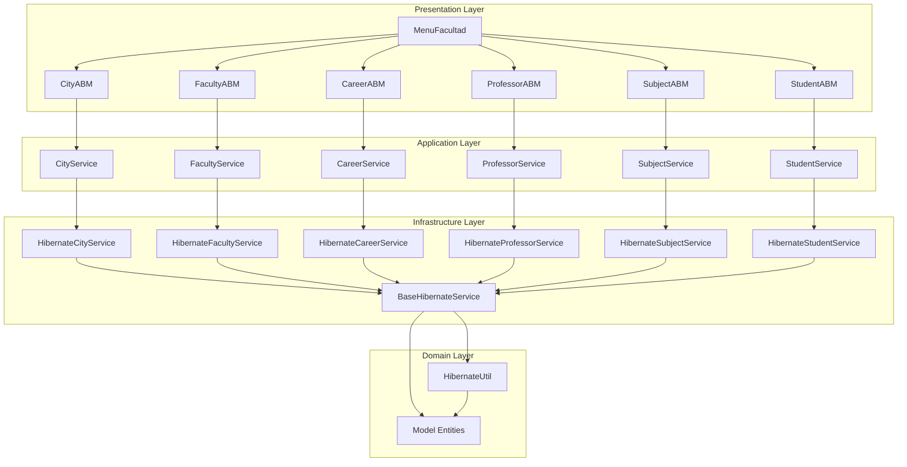

# Architecture Diagram

This diagram shows the Clean Architecture layers and their dependencies.

```mermaid
graph TB
    subgraph "Presentation Layer"
        A[MenuFacultad]
        B[CityABM]
        C[FacultyABM]
        D[CareerABM]
        E[ProfessorABM]
        F[SubjectABM]
        G[StudentABM]
    end
    
    subgraph "Application Layer"
        H[CityService]
        I[FacultyService]
        J[CareerService]
        K[ProfessorService]
        L[SubjectService]
        M[StudentService]
    end
    
    subgraph "Infrastructure Layer"
        N[BaseHibernateService]
        O[HibernateCityService]
        P[HibernateFacultyService]
        Q[HibernateCareerService]
        R[HibernateProfessorService]
        S[HibernateSubjectService]
        T[HibernateStudentService]
    end
    
    subgraph "Domain Layer"
        U[Model Entities]
        V[HibernateUtil]
    end
    
    A --> B
    A --> C
    A --> D
    A --> E
    A --> F
    A --> G
    
    B --> H
    C --> I
    D --> J
    E --> K
    F --> L
    G --> M
    
    H --> O
    I --> P
    J --> Q
    K --> R
    L --> S
    M --> T
    
    O --> N
    P --> N
    Q --> N
    R --> N
    S --> N
    T --> N
    
    N --> V
    N --> U
    V --> U
```

