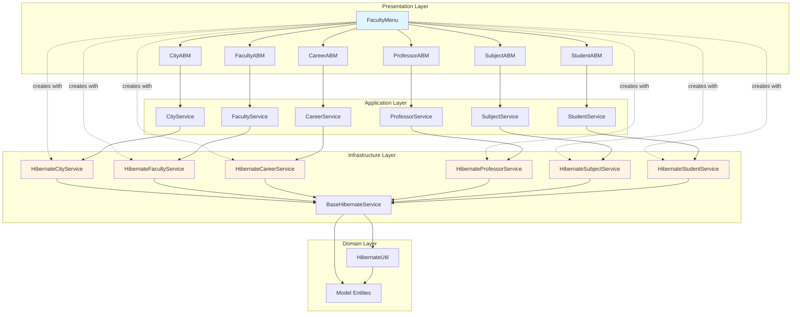

# Architecture Diagram

This diagram shows the Clean Architecture layers and their dependencies.

> **Note:** `FacultyMenu` creates Hibernate service implementations directly (dashed lines), which creates a coupling between Presentation and Infrastructure layers. The ABM classes depend on Service interfaces (solid lines), maintaining proper abstraction. In a production environment, this coupling could be resolved using Dependency Injection.

