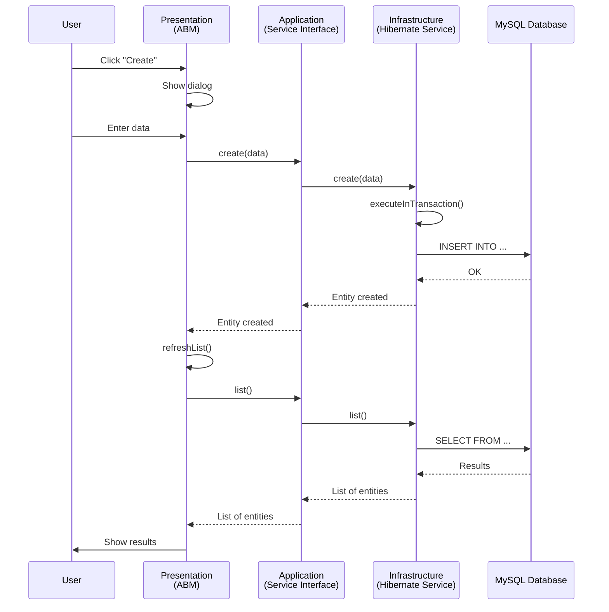

# Data Flow Diagram

This sequence diagram shows how data flows through the application layers when a user creates an entity.

```mermaid
sequenceDiagram
    participant User
    participant ABM as Presentation<br/>(ABM)
    participant Service as Application<br/>(Service Interface)
    participant Hibernate as Infrastructure<br/>(Hibernate Service)
    participant DB as MySQL Database

    User->>ABM: Click "Create"
    ABM->>ABM: Show dialog
    User->>ABM: Enter data
    ABM->>Service: create(data)
    Service->>Hibernate: create(data)
    Hibernate->>Hibernate: executeInTransaction()
    Hibernate->>DB: INSERT INTO ...
    DB-->>Hibernate: OK
    Hibernate-->>Service: Entity created
    Service-->>ABM: Entity created
    ABM->>ABM: refreshList()
    ABM->>Service: list()
    Service->>Hibernate: list()
    Hibernate->>DB: SELECT FROM ...
    DB-->>Hibernate: Results
    Hibernate-->>Service: List of entities
    Service-->>ABM: List of entities
    ABM->>User: Show results
```

