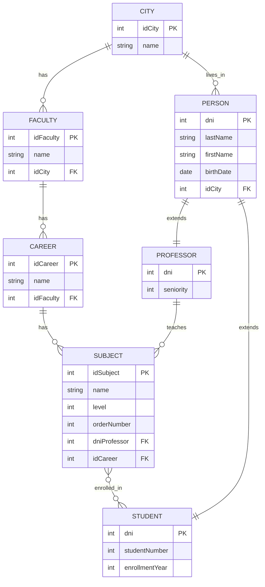

# Entity Relationship Diagram

This diagram shows the database schema and relationships between entities.

```mermaid
erDiagram
    PERSON ||--|| PROFESSOR : "extends"
    PERSON ||--|| STUDENT : "extends"
    CITY ||--o{ FACULTY : "has"
    CITY ||--o{ PERSON : "lives_in"
    FACULTY ||--o{ CAREER : "has"
    CAREER ||--o{ SUBJECT : "has"
    PROFESSOR ||--o{ SUBJECT : "teaches"
    SUBJECT }o--o{ STUDENT : "enrolled_in"

    PERSON {
        int dni PK
        string lastName
        string firstName
        date birthDate
        int idCity FK
    }

    CITY {
        int idCity PK
        string name
    }

    FACULTY {
        int idFaculty PK
        string name
        int idCity FK
    }

    CAREER {
        int idCareer PK
        string name
        int idFaculty FK
    }

    PROFESSOR {
        int dni PK
        int seniority
    }

    SUBJECT {
        int idSubject PK
        string name
        int level
        int orderNumber
        int dniProfessor FK
        int idCareer FK
    }

    STUDENT {
        int dni PK
        int studentNumber
        int enrollmentYear
    }
```

